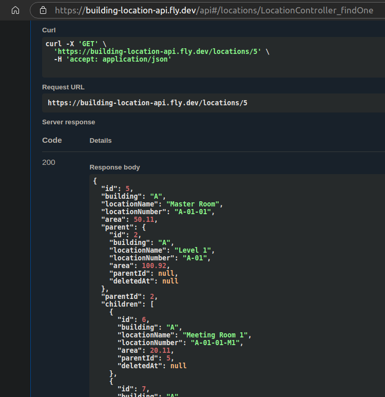

## Playground Swagger 

[https://building-location-api.fly.dev/api#/](https://building-location-api.fly.dev/api#/)

### Sample Tree Data: 
- Master room id: 5 is a child of Building A
- Master room id: 5 is a parent of 2 children: 2 Meeting rooms.

  Request: 
  ```
    curl -X 'GET' \
    'https://building-location-api.fly.dev/locations/5' \
    -H 'accept: application/json'
  ```
  Response body:
  ```
    {
      "id": 5,
      "building": "A",
      "locationName": "Master Room",
      "locationNumber": "A-01-01",
      "area": 50.11,
      "parent": {
        "id": 2,
        "building": "A",
        "locationName": "Level 1",
        "locationNumber": "A-01",
        "area": 100.92,
        "parentId": null,
        "deletedAt": null
      },
      "parentId": 2,
      "children": [
        {
          "id": 6,
          "building": "A",
          "locationName": "Meeting Room 1",
          "locationNumber": "A-01-01-M1",
          "area": 20.11,
          "parentId": 5,
          "deletedAt": null
        },
        {
          "id": 7,
          "building": "A",
          "locationName": "Meeting Room 2",
          "locationNumber": "A-01-01-M2",
          "area": 20.11,
          "parentId": 5,
          "deletedAt": null
        }
      ],
      "deletedAt": null
    }
  ```

## Project setup

```bash
$ npm install
```


## Compile and run the project

```bash
# development
$ npm run start

# watch mode
$ npm run start:dev

# production mode
$ npm run start:prod
```

## Seed data
- Uncomment line 32,33 from main.ts then recompile project.
