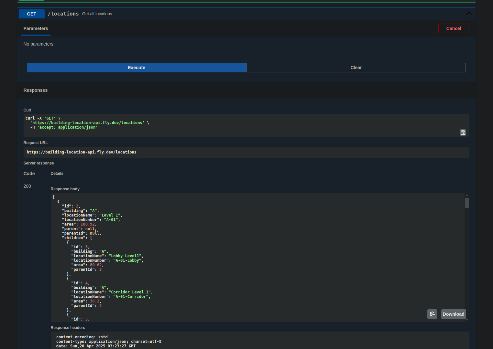

## Playground Swagger 

[https://building-location-api.fly.dev/api#/](https://building-location-api.fly.dev/api#/)

### Sample Tree Data 


  Req: 
  ```
  curl -X 'GET' \
  'https://building-location-api.fly.dev/locations/2' \
  -H 'accept: application/json' 
  ```
  Response body:
  ```
    {
    "id": 2,
    "building": "A",
    "locationName": "Level 1",
    "locationNumber": "A-01",
    "area": 100.92,
    "parent": null,
    "parentId": null,
    "children": [
            {
            "id": 3,
            "building": "A",
            "locationName": "Lobby Level1",
            "locationNumber": "A-01-Lobby",
            "area": 80.62,
            "parentId": 2
            },
            {
            "id": 4,
            "building": "A",
            "locationName": "Corridor Level 1",
            "locationNumber": "A-01-Corridor",
            "area": 30.2,
            "parentId": 2
            },
            {
            "id": 5,
            "building": "A",
            "locationName": "Master Room",
            "locationNumber": "A-01-01",
            "area": 50.11,
            "parentId": 2
            },
            {
            "id": 8,
            "building": "A",
            "locationName": "Toilet Level 1",
            "locationNumber": "A-01-02",
            "area": 30.2,
            "parentId": 2
            }
        ]
    }  

  ```

## Project setup

```bash
$ npm install
```


## Compile and run the project

```bash
# development
$ npm run start

# watch mode
$ npm run start:dev

# production mode
$ npm run start:prod
```

## Seed data
- Uncomment line 32,33 from main.ts then recompile project.
